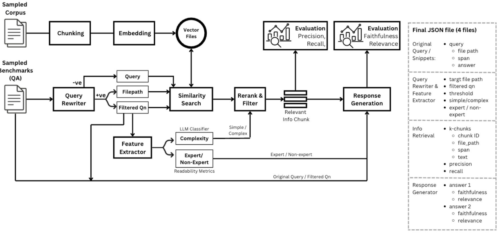

## Introduction
Please access the main google drive of this repository: [Google Drive](https://drive.google.com/drive/folders/1yvVzbvs6SDaaMTz6GnGP3yhz17QLddjn?usp=drive_link)

This repository presents an advanced **Retrieval-Augmented Generation (RAG) pipeline** designed for legal domain applications. The architecture enhances traditional LLM-based responses by integrating a structured **feature analysis** mechanism and a **vector-based information retrieval** system. 

The core workflow of this system is illustrated above, which consists of three main components:

1. **Query Translation (Feature Analysis)**  
   - The user's prompt (including conversation history) is processed through a **Feature Analysis** module to extract key aspects relevant to legal queries.
   - The output of this analysis is combined with the original user prompt to create an **enhanced query representation**.

2. **Information Retrieval (LegalBenchRAG Dataset)**  
   - The enhanced query is used to perform **vector search** on a pre-embedded legal dataset (**LegalBenchRAG**).
   - Relevant chunks of legal information are retrieved based on semantic similarity.

3. **Response Generation**  
   - The retrieved information chunks are fed into an **LLM (Large Language Model)** along with the processed query.
   - The model generates a final response, ensuring contextual accuracy and alignment with legal domain knowledge.

## Starters
1. Create python environment (conda or virtualnwrapper)
2. Run `pip install -r requirements.txt`
3. Explore `baseline` folder

## Folder Structure Conventions

    .
    ├── baseline                # First iteration and baseline models
    ├── data                    # Benchmark, Corpus, and Result files
    ├── information_retrieval   # All files related to retrieval process
    ├── main                    # Primary folder for main development
    ├── query_translation       # All files related to query translation process
    ├── readme                  # Attached files for README.md
    ├── response_generation     # All files related to response generation process
    ├── LICENSE
    ├── README.md 
    └── requirements.txt

## License
MIT License.